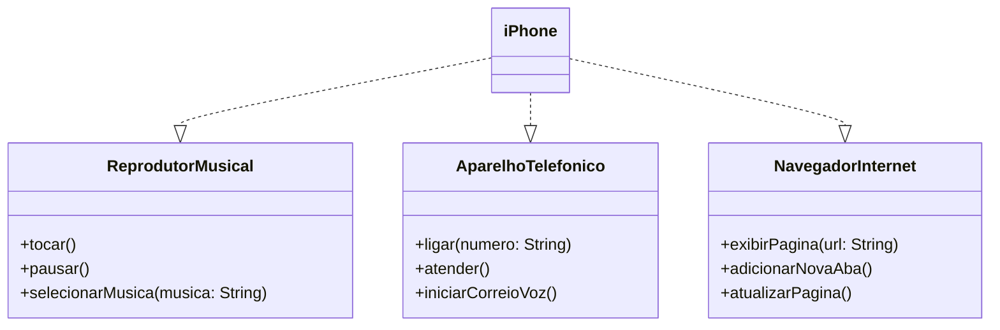

# iPhone UML Diagram

Este repositório apresenta a modelagem UML do iPhone, destacando suas funcionalidades principais: **Reprodutor Musical**, **Aparelho Telefônico** e **Navegador na Internet**. O objetivo é representar essas funcionalidades por meio de interfaces e uma classe concreta que implementa todas elas.

## 🚀 Funcionalidades

- **Reprodutor Musical**: tocar, pausar e selecionar música.
- **Aparelho Telefônico**: ligar, atender e iniciar correio de voz.
- **Navegador na Internet**: exibir página, adicionar nova aba e atualizar página.

## 📌 Diagrama UML

Abaixo está a representação UML do projeto utilizando **Mermaid**:



## 📂 Estrutura do Projeto

```
/iphone-uml
│── src/
│   ├── ReprodutorMusical.java
│   ├── AparelhoTelefonico.java
│   ├── NavegadorInternet.java
│   ├── iPhone.java
│   └── Main.java
│── README.md
│── .gitignore
│── LICENSE
```

## 🛠 Tecnologias Utilizadas

- **Java** para implementação das classes e interfaces.
- **Mermaid.js** para criação do diagrama UML.
- **Markdown** para documentação no `README.md`.

## 🎯 Como Executar o Projeto

1. Clone este repositório:
   ```sh
   git clone https://github.com/seu-usuario/iphone-uml.git
   ```
2. Acesse o diretório do projeto:
   ```sh
   cd iphone-uml
   ```
3. Compile os arquivos Java:
   ```sh
   javac src/*.java
   ```
4. Execute o programa principal:
   ```sh
   java src.Main
   ```

---

Criado por [Nicolas Valle](https://github.com/nicksvalle) 🚀

